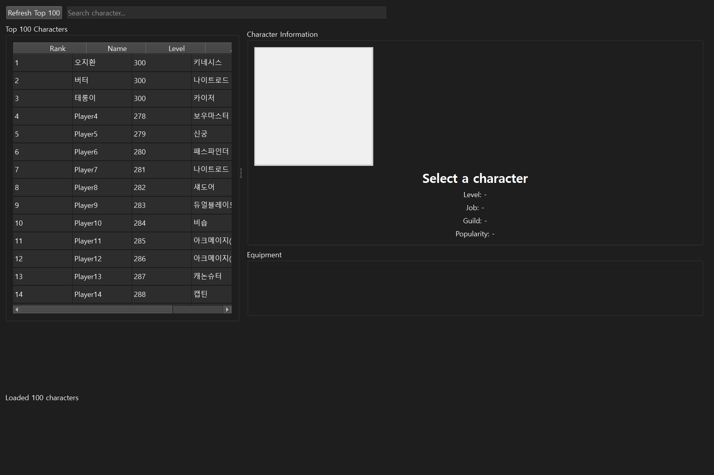
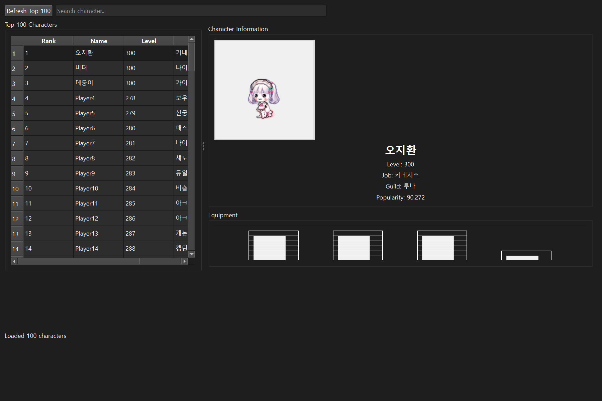
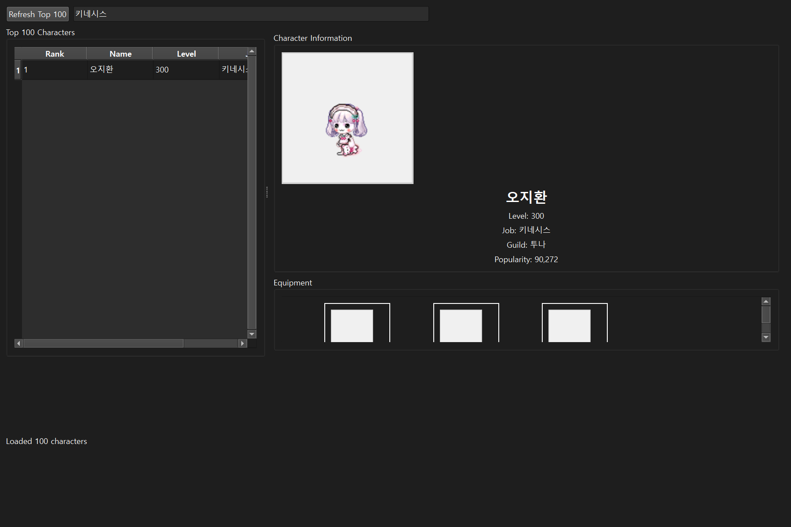

# Maple Story Universe API Test Application

[](https://github.com/Hakhyun-Kim/MSU_API_Test/actions/workflows/python-app.yml)
[](https://github.com/Hakhyun-Kim/MSU_API_Test/actions/workflows/build-release.yml)
[](https://github.com/Hakhyun-Kim/MSU_API_Test/releases)
[](https://opensource.org/licenses/MIT)

A desktop application for testing and exploring the Maple Story Universe (MSU) API, built with Python and PyQt6.

## 📥 Download Latest Release

<div align="center">

| Platform | Download |
|----------|----------|
| Windows  | [](https://github.com/Hakhyun-Kim/MSU_API_Test/releases/latest/download/MSU_API_Test-Windows.exe) |
| macOS    | [](https://github.com/Hakhyun-Kim/MSU_API_Test/releases/latest/download/MSU_API_Test-macOS) |
| Linux    | [](https://github.com/Hakhyun-Kim/MSU_API_Test/releases/latest/download/MSU_API_Test-Linux) |

</div>

## 📸 Screenshots

### Main Window

*The main application window showing the top 100 characters list*

### Character Details

*Detailed view of a selected character with equipment slots*

### Search Function

*Search functionality to filter characters by name or job*

## ✨ Features

- 🎮 Fetch and display top 100 MapleStory characters
- 👤 View character details including level, job, guild, and popularity
- 🎨 Display character avatars from official Nexon servers
- 💎 Display character equipment with item images (when available)
- 🔍 Search and filter characters by name or job
- 🖥️ Cross-platform support (Windows and macOS)
- 🧵 Asynchronous data loading with threading

## 🔧 Requirements

- Python 3.10 or higher
- PyQt6
- See `requirements.txt` for full dependencies

### System Requirements (Linux)

On Linux systems, you may need to install additional system packages:

```bash
sudo apt-get update
sudo apt-get install -y \
  libgl1 \
  libegl1 \
  libxkbcommon-x11-0 \
  libxcb-icccm4 \
  libxcb-image0 \
  libxcb-keysyms1 \
  libxcb-randr0 \
  libxcb-render-util0 \
  libxcb-xinerama0 \
  libxcb-xfixes0 \
  libfontconfig1 \
  libdbus-1-3
```

## 📦 Installation

### Option 1: Download Pre-built Release (Recommended)

1. Click the download button for your platform in the [Download Latest Release](#-download-latest-release) section above
2. Or visit the [Releases](https://github.com/Hakhyun-Kim/MSU_API_Test/releases) page for all versions
3. Run the downloaded file:
   - **Windows**: Double-click `MSU_API_Test-Windows.exe`
   - **macOS**: Open terminal and run `chmod +x MSU_API_Test-macOS && ./MSU_API_Test-macOS`
   - **Linux**: Open terminal and run `chmod +x MSU_API_Test-Linux && ./MSU_API_Test-Linux`

### Option 2: Build from Source

1. Clone the repository:
```bash
git clone https://github.com/Hakhyun-Kim/MSU_API_Test.git
cd MSU_API_Test
```

2. Create a virtual environment (recommended):
```bash
python -m venv venv

# On Windows:
venv\Scripts\activate

# On macOS/Linux:
source venv/bin/activate
```

3. Install dependencies:
```bash
pip install -r requirements.txt
```

4. (Optional) Build standalone executable:
```bash
python build.py
```

## 🚀 Running the Application

```bash
python main.py
# or on Windows:
py main.py
```

## 📁 Project Structure

```
MSU_API_Test/
├── main.py              # Application entry point
├── requirements.txt     # Python dependencies
├── README.md           # This file
├── .gitignore          # Git ignore rules
├── api/                # API client modules
│   ├── __init__.py
│   └── api_client.py   # MSU API client implementation
├── models/             # Data models
│   ├── __init__.py
│   ├── character.py    # Character data model
│   └── item.py        # Item data model
├── ui/                 # User interface components
│   ├── __init__.py
│   ├── main_window.py  # Main application window
│   └── character_widget.py  # Character display widget
└── screenshots/        # Application screenshots
    ├── main_window.png
    ├── character_details.png
    └── search_function.png
```

## 📖 Usage

1. **Launch the application** - The top 100 characters will be loaded automatically
2. **Browse characters** - Scroll through the character list on the left
3. **View details** - Click on any character to see their information and equipment
4. **Search** - Use the search box to filter by character name or job class
5. **Refresh** - Click "Refresh Top 100" to reload the latest character data

## 🔌 API Integration

Currently, the application uses mock data that simulates the MapleStory Universe API response. To integrate with the real API:

1. Register at [MapleStory Network](https://maplestory.net/develop)
2. Create an app to obtain your API key
3. Update `api/api_client.py` with your credentials:
```python
client = MSUApiClient(
    base_url="https://api.maplestory.net",
    api_key="YOUR_API_KEY_HERE"
)
```

## 🛠️ Development

### Adding New Features

- **Character Stats**: Extend the `Character` model in `models/character.py`
- **UI Enhancements**: Modify `ui/character_widget.py` for display improvements
- **API Endpoints**: Add new methods in `api/api_client.py`

### Building for Distribution

To create a standalone executable:
```bash
pip install pyinstaller
pyinstaller --windowed --onefile main.py
```

## 🤝 Contributing

1. Fork the repository
2. Create your feature branch (`git checkout -b feature/AmazingFeature`)
3. Commit your changes (`git commit -m 'Add some AmazingFeature'`)
4. Push to the branch (`git push origin feature/AmazingFeature`)
5. Open a Pull Request

## 📦 Creating a Release

### Automatic Releases (Recommended)

This project supports multiple ways to create releases automatically:

#### 1. Commit-based Auto Release
Every push to `main` branch will automatically create a release if there are new commits. Version is determined by commit messages:
- `fix:` or `perf:` → Patch release (1.0.0 → 1.0.1)
- `feat:` or `feature:` → Minor release (1.0.0 → 1.1.0)
- `BREAKING CHANGE:` → Major release (1.0.0 → 2.0.0)

#### 2. Manual Trigger from GitHub Actions
1. Go to [Actions](https://github.com/Hakhyun-Kim/MSU_API_Test/actions/workflows/auto-release.yml)
2. Click "Run workflow"
3. Select release type (patch/minor/major)
4. Click "Run workflow"

#### 3. Scheduled Releases
Automatic weekly releases every Sunday (if there are new commits)

### Manual Release

```bash
# Using the helper script
py create_release.py

# Or manually with git
git tag -a v1.0.0 -m "Release version 1.0.0"
git push origin v1.0.0
```

All methods will trigger GitHub Actions to:
- Build executables for Windows, macOS, and Linux
- Create a GitHub release with the built files
- Upload the executables as release assets

### ⚠️ Important: GitHub Repository Settings

For automatic releases to work, ensure your repository has the correct permissions:
1. Go to Settings → Actions → General
2. Under "Workflow permissions", select "Read and write permissions"
3. Check "Allow GitHub Actions to create and approve pull requests"
4. Click "Save"

## 📝 Known Limitations

- Currently uses mock data instead of live API
- Item images are placeholders
- Limited to top 100 characters
- Equipment potential and stats not displayed

## 🔮 Future Enhancements

- [ ] Real MSU API integration
- [ ] Character comparison features
- [ ] Export character data to CSV/JSON
- [ ] Dark mode theme
- [ ] Multi-language support
- [ ] Character build analyzer
- [ ] Guild rankings view

## 📄 License

This project is for educational and testing purposes only. MapleStory and all related content are property of Nexon Corporation.

## 🙏 Acknowledgments

- Nexon for MapleStory Universe
- PyQt6 for the GUI framework
- The MapleStory community

---

**Note**: This is an unofficial application and is not affiliated with or endorsed by Nexon Corporation. 